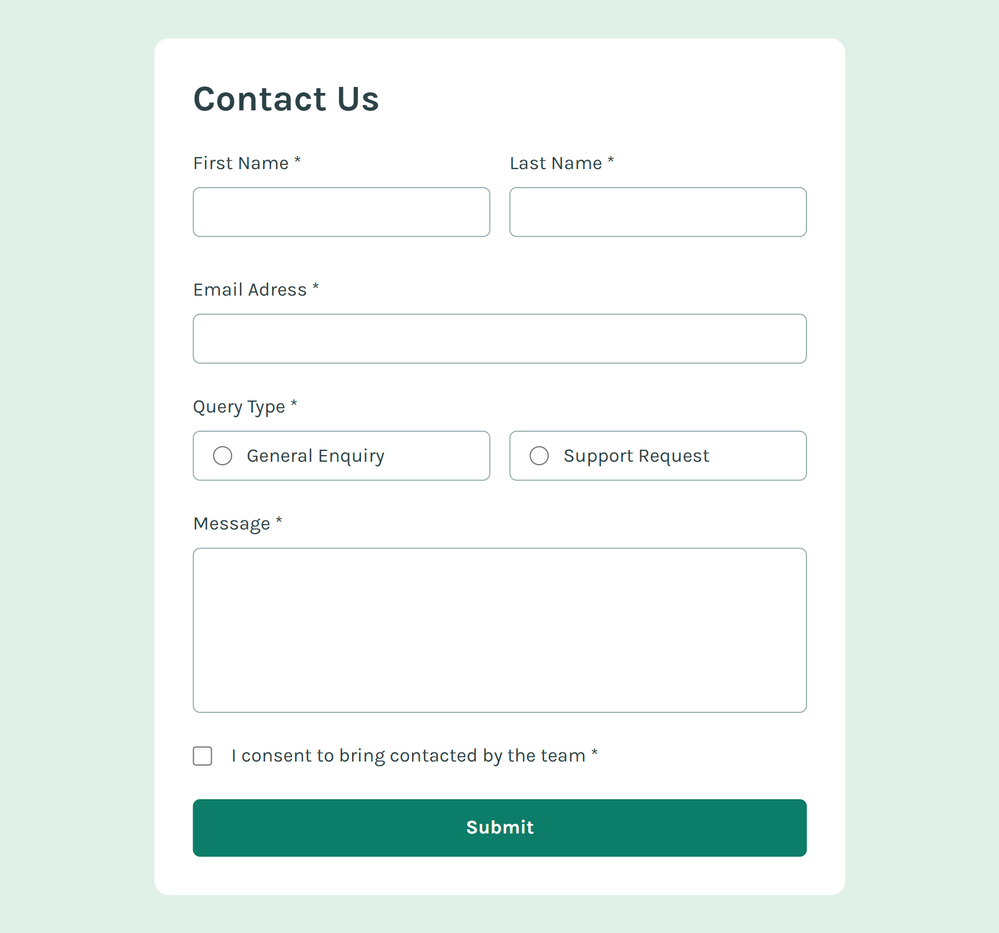

# Contact Form

This is a Frontend Mentor project, a contact form with multiple input fields, radio buttons and a checkbox.

The form includes validation:
- Displays error messages when fields are filled incorrectly
- Shows a success message when all inputs are valid

The project is built using React, with the form split into reusable components. State management is handled using `useState` and success message are implemented with `useEffect` and `setTimeout`.

## Live Site
[View Live Site](https://preeminent-naiad-853566.netlify.app/)

## Screenshot
